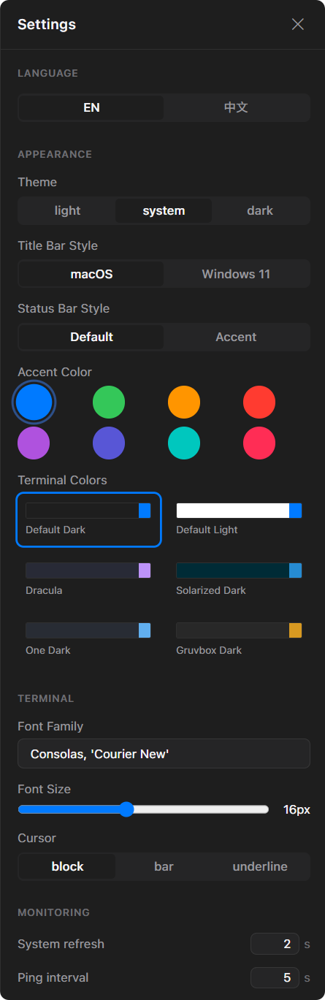
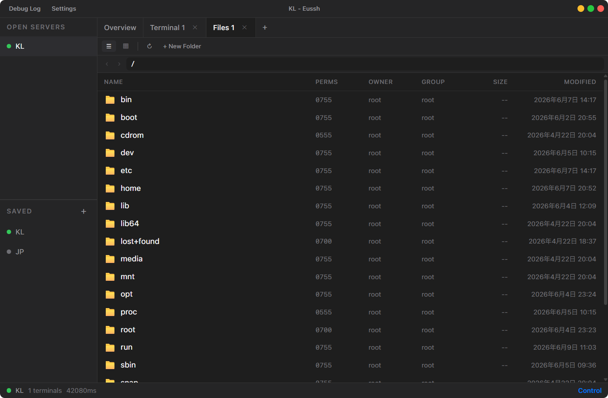
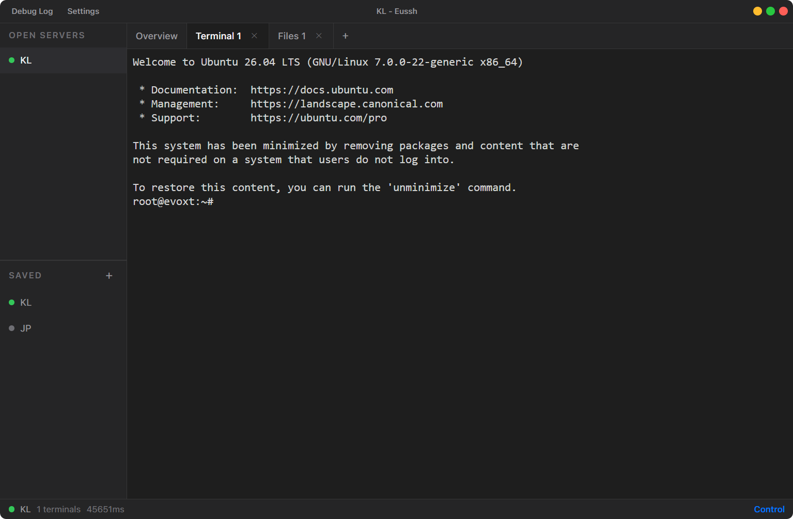

# Eussh


**Eussh** 是一个使用 Tauri v2 构建的跨平台 SSH 客户端，界面简洁、性能出色，支持多标签页管理、文件管理以及多服务器同时连接。

## 📸 截图

<table>
<tr><td></td><td rowspan="3" valign="top"></td></tr>
<tr><td></td></tr>
<tr><td></td></tr>
</table>

## ✨ 功能特性

- **多服务器** — 同时连接多个服务器，一键切换，各服务器终端完全独立
- **多标签页** — 一个服务器可同时打开多个终端和文件管理器
- **服务器总览** — CPU、内存、磁盘、交换分区实时监控 + 世界地图服务器定位 + 全部 IP 展示
- **文件管理器** — 列表/图标视图、上传/下载、拖拽上传、权限管理
- **SSH 连接** — 密码和私钥认证（纯 Rust `russh` 实现，无 C 依赖）
- **界面自定义** — 标题栏（macOS / Windows 11 风格）、底栏（默认 / 主题色）、6 种终端配色、8 种强调色
- **数据安全** — 连接配置使用 AES-256-GCM 加密存储
- **实时流量** — 底栏显示服务器上下行流量速率，终端和文件传输数据全覆盖
- **精确延迟** — 独立通道 ping 检测，不受命令队列阻塞
- **多语言** — 中文 / English
- **版本更新** — 启动时自动检查 GitHub Release，一键跳转下载

## 📦 安装

### 从 Release 下载

前往 [Releases](https://github.com/eussh/eussh/releases) 页面下载对应平台的安装包。

- **Windows**: `.msi` 和 `.exe` 安装程序
- **macOS**: `.dmg` 磁盘映像
- **Linux**: `.deb` 和 `.AppImage` 包

### 从源码构建

**环境要求：**

- [Node.js](https://nodejs.org/) >= 18
- [Rust](https://www.rust-lang.org/) stable (MSVC on Windows)
- 系统 WebView 组件（Windows 10+ 自带、macOS 自带、Linux 需 `libwebkit2gtk-4.1`）

```bash
# 克隆仓库
git clone https://github.com/eussh/eussh.git
cd eussh

# 安装前端依赖
npm install

# 开发模式运行
npx tauri dev

# 生产构建
npx tauri build
```

## 🖥 使用指南

### 添加服务器

点击左侧边栏底部的 **+** 按钮，填写服务器信息：

- 服务器名称（自定义）
- 主机地址（IP 或域名）
- 端口（默认 22）
- 用户名
- 认证方式：密码 或 私钥文件

### 连接服务器

点击已保存的服务器即可连接。连接成功后在侧边栏上方显示，同时打开**服务器总览**页面，显示 CPU、内存、磁盘等实时指标。

### 终端操作

- 点击标签栏的 **+** → **新建终端** 打开新终端
- 终端支持完整的 PTY 交互（xterm.js）
- 右键粘贴、复制
- 多服务器终端完全独立，切换无干扰

### 文件管理

- 点击标签栏的 **+** → **文件管理** 或总览页的 **文件管理** 按钮
- 双击文件夹进入，双击文件下载
- 右键菜单：下载、复制、剪切、粘贴、创建副本、重命名、删除、权限设置
- 支持从本地拖拽文件/文件夹上传
- 文件夹下载将打包为 `.tar.gz`

### 设置

点击标题栏的**设置**按钮，可配置：
- 语言：中文 / English
- 主题：浅色 / 系统 / 深色
- 标题栏样式：macOS 圆点 / Windows 11 方形按钮
- 底栏样式：默认 / 主题色
- 终端配色方案（6 种）
- 自定义强调色（8 种预设）
- 终端字体、字号、光标样式
- 监控刷新间隔、延迟检测间隔、流量监控
- 启动时自动检查更新

## 🏗 技术栈

| 层 | 技术 |
|---|---|
| 桌面框架 | [Tauri v2](https://v2.tauri.app/) |
| 前端 | Vue 3 + Vite + Pinia + Tailwind CSS |
| 终端 | [xterm.js](https://xtermjs.org/) |
| SSH | [russh](https://github.com/warp-tech/russh) (纯 Rust) |
| 加密 | AES-256-GCM + PBKDF2 |

**纯 Rust 依赖链** — 项目不依赖任何 C 编译工具，所有 SSH 和加密操作均由纯 Rust 实现完成。

## 📄 开源许可

本项目采用 [MIT License](LICENSE) 开源。

## 🤝 贡献

欢迎提交 Issue 和 Pull Request。

---

Made with ❤️ using Tauri & Vue
